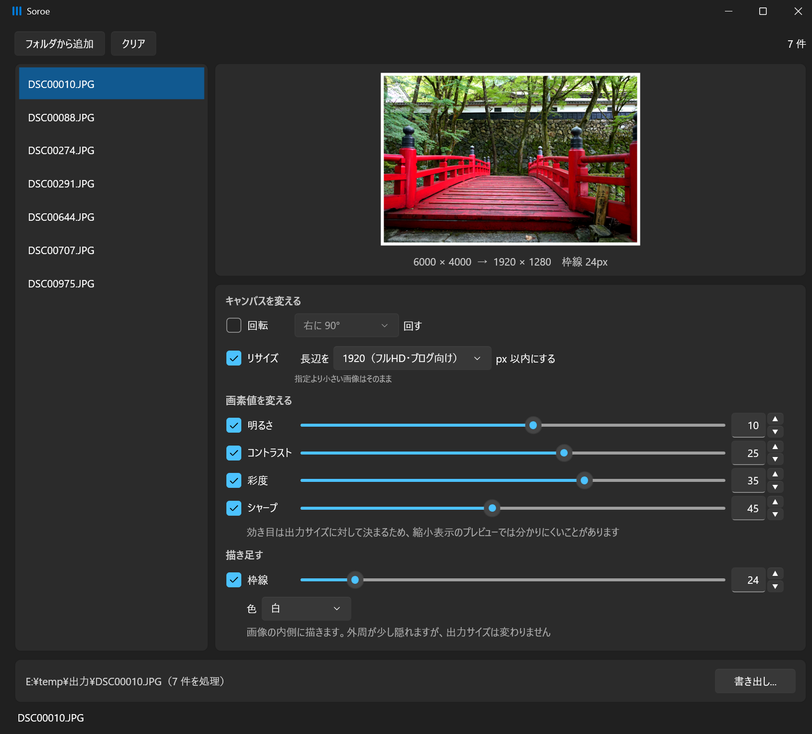
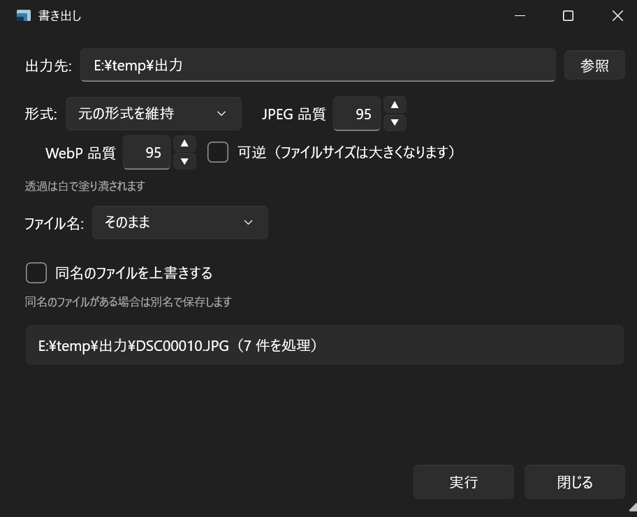

# Soroe

*A Windows desktop app for batch image processing. The user interface is in Japanese only.*

たくさんの画像を、**同じ設定でまとめて揃える** Windows 用のソフトです。
リサイズ・明るさ・枠線など 9 つの調整を選んで、フォルダごと一度に書き出します。
**画面で見えているプレビューが、そのまま書き出されます。**

## ダウンロード

[**Releases** から `Soroe-1.0.0-win-x64.zip` をダウンロードしてください](../../releases)（約 82MB）。

zip を好きな場所に解凍して、`Soroe.exe` を実行するだけです。インストールは要りません。
**.NET などのランタイムを別に入れる必要はありません**（必要なものは同梱しています）。

初回の起動時に **「Windows によって PC が保護されました」** という青い画面が出ることがあります。
配布者の署名が無い実行ファイルに Windows が出すものです。
**「詳細情報」を押すと「実行」ボタンが現れます。**

## 持ち運べます

- **インストーラはありません。** 解凍したフォルダの中だけで完結します
- **レジストリを使いません。** 設定は `Soroe.exe` と同じ場所の `settings.json` に入ります
- **フォルダごと削除すれば、跡形もなく消えます**
- USB メモリに入れて別の PC で使えます

## できること

画像をドロップして、使いたい調整だけをチェックします。**既定ではすべてオフ**です。

| 分類 | 調整 | 何をするか |
|---|---|---|
| キャンバスを変える | 回転 | 右に 90°／180°／左に 90° |
| | リサイズ | 長辺を指定の px 以内に収める |
| 画素値を変える | 明るさ | 明るく／暗く |
| | コントラスト | メリハリを強く／弱く |
| | 彩度 | 鮮やかに／地味に |
| | グレースケール | 白黒にする |
| | 二値化 | 白と黒だけにする |
| | シャープ | 輪郭をはっきりさせる |
| 描き足す | 枠線 | 内側に白／黒／グレーの枠を描く |

**かける順番は固定です**（上の表の順）。順番を並べ替えることはできません。

## 使い方

1. **画像を追加する** — ウィンドウに画像やフォルダをドロップするか、「フォルダから追加」を押します
2. **調整する** — 使いたい項目にチェックを入れて値を決めます。プレビューで結果を確認できます
3. **書き出す** — 「書き出し...」を押すと、出力先と形式を決める画面が出ます

実行する前に、**1 枚目がどこにどんな名前で保存されるか**と**何件処理するか**が表示されます。

## 対応している形式

| | 形式 |
|---|---|
| 読み込み | JPEG (`.jpg` `.jpeg`)／PNG (`.png`)／BMP (`.bmp`)／WebP (`.webp`) |
| 書き出し | JPEG／PNG／BMP／WebP／**元の形式を維持** |

「元の形式を維持」を選ぶと、JPEG は JPEG のまま、PNG は PNG のまま書き出します。

## 動作環境

- **Windows 11（64bit）で動作を確認しています。**
  それ以外の Windows では確認できていません
- ランタイムの追加インストールは不要です。.NET も Visual C++ 再頒布可能パッケージも要りません
- 解凍後のフォルダは約 200MB を使います

**Media Foundation を含まない Windows では起動できません。** 画像処理に使っている
ライブラリが Media Foundation（`MFPlat.dll` など）を必要とするためです。
該当するのは主に **「N」エディション**（EU 向けに販売されている、メディア機能を
省いた版）で、この場合は Microsoft が配布している **Media Feature Pack** を入れると
必要な機能が追加されます。
※ N エディションでの動作は確認できていないため、Media Feature Pack の導入で
起動するかどうかは未確認です。

## 仕様として決めていること

**以下は不具合ではなく、意図してそう決めた動作です。**

- **元の画像は絶対に変更しません。** 書き出しは別のファイルに対して行います。
  出力先が元のファイルと同じ場所・同じ名前になる場合は、**その 1 枚を飛ばします**
- **Exif は残りません。** 撮影日時・カメラの機種・**位置情報**も消えます。
  公開用の画像を作るときはむしろ都合が良い面もあります
- **透過は白で塗り潰されます。** 透過 PNG を読み込むと、透明な部分は白になります
- **サブフォルダは読みません。** 選んだフォルダの直下にある画像だけが対象です
- **拡大はしません。** リサイズで指定した長辺より小さい画像は、そのままの大きさで出ます
- **二値化のしきい値は画像ごとに自動で決まります。** 数値で指定することはできません
- **枠線は画像の内側に描きます。** 外周が少し隠れますが、**出力サイズは変わりません**
- **シャープはプレビューでは分かりにくいことがあります。** 効き目は書き出しサイズに対して
  決まるため、縮小して表示しているプレビューでは差が小さく見えます
- **設定は自動で保存されます。** 次に開くと前回の設定に戻ります
- **同時に複数起動した場合**、あとから閉じたウィンドウの設定が残ります

## ライセンス

Soroe は [MIT ライセンス](LICENSE) です。

**同梱しているバイナリには、それぞれ別のライセンスが適用されます。**
中には MIT より厳しい条件のものもあります。詳しくは
[THIRD-PARTY-NOTICES.txt](THIRD-PARTY-NOTICES.txt) をご覧ください。

## 名前について

「揃える」に由来します。バラバラな画像を一度に揃える、という役割をそのまま名前にしました。

---

## English

**Soroe** is a Windows desktop app for batch image processing. Drop a folder of
images, pick from nine adjustments (rotate, resize, brightness, contrast,
saturation, grayscale, binarize, sharpen, border), and export them all at once.
What you see in the preview is what gets written.

**The user interface is in Japanese only**, and there are no plans to translate it.

Soroe itself is under the [MIT License](LICENSE). Bundled binaries are covered by
their own licenses, some of which are stricter than MIT — see
[THIRD-PARTY-NOTICES.txt](THIRD-PARTY-NOTICES.txt).
